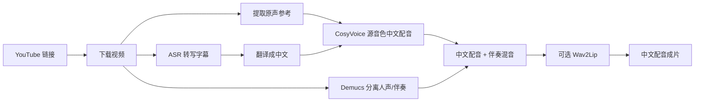

# yt-dub-studio

**把英文 YouTube 视频变成中文配音成片：尽量保留原说话人音色，并可选做唇形同步。**

yt-dub-studio 是一个本地 AI 视频配音工作台，面向想把英文视频快速本地化成中文内容的创作者、教育者和开发者。你只需要贴一个 YouTube 链接，选择少量参数，就可以跑通从下载、转写、翻译、源音色中文配音、混音到可选唇形同步的完整链路。

语言：中文 | [English](docs/README.en.md)

[安装指南](docs/setup.md) · [YouTube Pipeline 说明](docs/youtube-pipeline-app.md) · [唇形同步说明](docs/lipsync-pipeline.md)


## 五分钟 Demo

下面这个案例展示了完整链路的效果：英文 YouTube 视频前 5 分钟 → 中文源音色配音 → Wav2Lip 唇形同步 → 最终成片。

<video src="https://raw.githubusercontent.com/nateEc/yt-dub-studio/main/docs/demo/wtf-loop-engineer-first5-sourcevoice-wav2lip.mp4" controls poster="https://raw.githubusercontent.com/nateEc/yt-dub-studio/main/docs/demo/wtf-loop-engineer-first5-sourcevoice-wav2lip.jpg" width="100%"></video>

如果播放器没有显示，可以直接打开：[5 分钟 MP4 Demo](docs/demo/wtf-loop-engineer-first5-sourcevoice-wav2lip.mp4)。

## 为什么做这个

很多视频本地化工具只停在字幕或普通 TTS。yt-dub-studio 想解决的是更完整的问题：

- 中文配音不应该听起来像随机机器声，而应该尽量接近原说话人的音色。
- 翻译后的音频需要尽量贴合原视频节奏，减少漂移。
- 最终输出应该是可直接观看和发布的视频文件。
- 整条链路应该能在本地运行、调试、替换模块，而不是黑盒服务。

它不是一个 SaaS 套壳，而是一个可以本地运行、可以拆开看、可以继续改造的 AI dubbing pipeline。

## 它能做什么

| 阶段 | 作用 |
| --- | --- |
| 下载 | 用 `yt-dlp`/ffmpeg 拉取 YouTube 视频并抽取音频。 |
| 转写 | 用 Whisper/faster-whisper 生成英文字幕。 |
| 翻译 | 将字幕翻译成中文简体。 |
| 源音色配音 | 用 CosyVoice 基于原视频人声参考生成中文配音。 |
| 混音 | 用 Demucs 分离人声/伴奏，把中文配音混回视频。 |
| 唇形同步 | 可选使用 Wav2Lip，让口型尽量跟随中文配音。 |
| 导出 | 输出最终视频、配音音频、字幕和中间文件。 |

## Pipeline



## 产品亮点

- **源音色中文配音**：默认使用 CosyVoice cross-lingual 合成，让中文声音尽量贴近原说话人，而不是普通 TTS 音色。
- **一屏完成 workflow**：专用 Gradio 页面包含 URL 输入、耗时估算、高级设置、输出预览、运行日志、字幕和生成文件。
- **唇形同步可用**：内置 Wav2Lip runtime 准备脚本；需要真实口型结果时可以开启严格模式，失败就明确报错。
- **CLI 友好**：Web UI 能做的核心操作，`run-youtube-pipeline.py` 也能跑，适合自动化和批处理。
- **本地优先**：模型推理主要在本机运行，视频和中间产物留在 `workspace/`。
- **容易继续改**：pipeline 编排、UI、唇形同步 adapter、耗时估算和测试都拆在独立模块里。

## 快速开始

先看完整安装文档：

```bash
git clone https://github.com/nateEc/yt-dub-studio.git
cd yt-dub-studio
```

然后打开：

[docs/setup.md](docs/setup.md)

环境准备好后，启动专用 Web App：

```bash
installer_files/env/bin/python start-youtube-pipeline.py
```

访问：

```text
http://127.0.0.1:7861
```

贴入 YouTube 链接，默认就是英文到中文的源音色配音流程，点击 **开始生成** 即可。

## CLI 预览

```bash
installer_files/env/bin/python run-youtube-pipeline.py "https://www.youtube.com/watch?v=VIDEO_ID" \
  --source-language English \
  --target-language "Chinese (simplified)" \
  --media-language english \
  --tts-strategy source_voice \
  --enable-lip-sync \
  --lip-sync-engine Wav2Lip
```

快速 smoke test 可以只处理 30 秒：

```bash
installer_files/env/bin/python run-youtube-pipeline.py "https://www.youtube.com/watch?v=VIDEO_ID" \
  --clip-seconds 30 \
  --tts-strategy source_voice \
  --enable-lip-sync \
  --lip-sync-engine Wav2Lip
```

更多命令见 [安装指南](docs/setup.md)。

## 输出内容

每次运行会在 `workspace/` 下生成一组产物：

- 下载后的源视频和抽取音频
- 英文字幕和中文字幕
- 分离后的人声/伴奏
- 源音色中文配音音频
- 换音轨视频
- 可选 Wav2Lip 口型同步结果
- Gradio 页面展示的最终成片

## 适合谁

yt-dub-studio 适合这些场景：

- 把英文教育/技术视频本地化成中文内容
- 快速验证 AI dubbing 产品原型
- 对比普通 TTS 和源音色克隆效果
- 研究或替换唇形同步模块
- 搭建不依赖公开视频云服务的私有视频翻译 pipeline

## 负责任使用

这个项目可以模拟声音特征并修改视频中的说话内容。请只处理你拥有版权、获得授权，或法律允许处理的内容。对外发布时请适当披露 AI 配音，不要用于冒充他人或误导观众。

## 项目结构

```text
app/tab_youtube_pipeline.py       专用 Gradio UI
app/abus_pipeline.py              YouTube pipeline 编排
app/abus_lipsync.py               MuseTalk/Wav2Lip adapter
app/abus_pipeline_estimate.py     运行耗时/消耗估算
run-youtube-pipeline.py           CLI 入口
start-youtube-pipeline.py         Web App 入口
scripts/setup-wav2lip-runtime.py  Wav2Lip runtime 准备脚本
docs/setup.md                     安装和运行文档
tests/                            pipeline 相关测试
```

## 致谢

yt-dub-studio 基于 [Voice-Pro](https://github.com/abus-aikorea/voice-pro) 改造，并结合了 Whisper、faster-whisper、Demucs、CosyVoice、Gradio、yt-dlp、ffmpeg、Wav2Lip 等开源生态能力。

## License

本仓库保留 Voice-Pro 原始 GPLv3 license。分发、商用或二次开发前，也请确认第三方模型和 runtime 的各自许可证。
