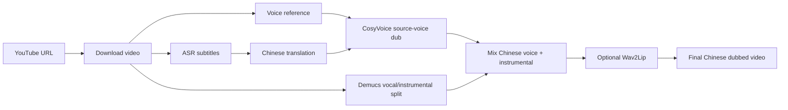

# yt-dub-studio

**Turn English YouTube videos into Chinese-dubbed videos with source-voice cloning and optional lip sync.**

yt-dub-studio is a local AI dubbing workspace for creators, educators, and builders who want a complete YouTube-to-Chinese video pipeline instead of a pile of separate scripts. Paste a YouTube URL, choose a few options, and generate a Chinese dubbed video that keeps the speaker's timbre as much as possible.

Language: [中文](../README.md) | English

[Setup Guide](setup.en.md) · [YouTube Pipeline Notes](youtube-pipeline-app.md) · [Lip Sync Notes](lipsync-pipeline.md)


## Five-Minute Demo

This sample shows the full workflow in action: the first five minutes of an English YouTube video → Chinese source-voice dubbing → Wav2Lip lip sync → final rendered video.

<video src="https://raw.githubusercontent.com/nateEc/yt-dub-studio/main/docs/demo/wtf-loop-engineer-first5-sourcevoice-wav2lip.mp4" controls poster="https://raw.githubusercontent.com/nateEc/yt-dub-studio/main/docs/demo/wtf-loop-engineer-first5-sourcevoice-wav2lip.jpg" width="100%"></video>

If the player does not render, open the file directly: [5-minute MP4 demo](demo/wtf-loop-engineer-first5-sourcevoice-wav2lip.mp4).

## Why This Exists

Most video localization tools stop at subtitles or generic TTS. yt-dub-studio is built around a more ambitious workflow:

- The translated voice should sound closer to the original speaker.
- The Chinese audio should stay aligned with the source timing.
- The final output should be a real video file, not just separate subtitles and audio.
- The whole workflow should be runnable locally and inspectable end to end.

It is not a SaaS wrapper. It is a local pipeline you can run, inspect, modify, and extend.

## What It Does

| Stage | What happens |
| --- | --- |
| Download | Pulls the YouTube video and extracts audio with `yt-dlp`/ffmpeg. |
| Transcribe | Generates source subtitles with Whisper/faster-whisper. |
| Translate | Converts subtitles to Chinese. |
| Clone voice | Uses CosyVoice to synthesize Chinese speech from the source speaker's vocal reference. |
| Mix | Separates vocals/instrumental with Demucs and mixes the Chinese dub back into the video. |
| Lip sync | Optionally runs Wav2Lip so the mouth motion follows the dubbed audio. |
| Export | Produces video, audio, subtitles, and intermediate files in `workspace/`. |

## Pipeline



## Product Highlights

- **Source-voice Chinese dubbing**: default TTS strategy uses CosyVoice cross-lingual synthesis, so the Chinese track is not a random stock voice.
- **One-screen workflow**: a dedicated Gradio app for URL input, estimates, advanced settings, outputs, logs, subtitles, and generated files.
- **Lip-sync ready**: Wav2Lip runtime setup script included; strict mode can fail loudly when real lip sync is required.
- **CLI friendly**: every important option is available through `run-youtube-pipeline.py`.
- **Local-first**: model inference runs locally; outputs and intermediates stay in your `workspace/`.
- **Forkable architecture**: pipeline orchestration, UI, lip-sync adapters, estimates, and tests are separated into small modules.

## Quick Start

Follow the full setup guide first:

```bash
git clone https://github.com/nateEc/yt-dub-studio.git
cd yt-dub-studio
```

Then open:

[docs/setup.en.md](setup.en.md)

Once the environment is ready, launch the dedicated web app:

```bash
installer_files/env/bin/python start-youtube-pipeline.py
```

Open:

```text
http://127.0.0.1:7861
```

Paste a YouTube URL, keep the defaults for English-to-Chinese dubbing, and click **开始生成**.

## CLI Preview

```bash
installer_files/env/bin/python run-youtube-pipeline.py "https://www.youtube.com/watch?v=VIDEO_ID" \
  --source-language English \
  --target-language "Chinese (simplified)" \
  --media-language english \
  --tts-strategy source_voice \
  --enable-lip-sync \
  --lip-sync-engine Wav2Lip
```

For a fast smoke test, process only a short clip:

```bash
installer_files/env/bin/python run-youtube-pipeline.py "https://www.youtube.com/watch?v=VIDEO_ID" \
  --clip-seconds 30 \
  --tts-strategy source_voice \
  --enable-lip-sync \
  --lip-sync-engine Wav2Lip
```

More commands live in the [setup guide](setup.en.md).

## Outputs

Each run creates a workspace folder with:

- source video and extracted audio
- source subtitles and Chinese subtitles
- separated vocal/instrumental tracks
- source-voice Chinese dub audio
- audio-replaced video
- optional Wav2Lip result
- final video path surfaced in the Gradio UI

## When To Use It

yt-dub-studio is useful when you want to:

- localize English educational videos into Chinese
- prototype AI dubbing workflows
- compare generic TTS with source-voice cloning
- experiment with lip-sync adapters
- build a private video translation pipeline without sending full videos to a hosted product

## Responsible Use

This project can clone voice characteristics and modify video speech. Use it only for content you own, have permission to transform, or are legally allowed to process. Disclose synthetic dubbing where appropriate, and do not use it to impersonate people or mislead viewers.

## Project Map

```text
app/tab_youtube_pipeline.py       dedicated Gradio UI
app/abus_pipeline.py              YouTube pipeline orchestration
app/abus_lipsync.py               MuseTalk/Wav2Lip adapter layer
app/abus_pipeline_estimate.py     runtime/cost estimates
run-youtube-pipeline.py           CLI entry point
start-youtube-pipeline.py         web app entry point
scripts/setup-wav2lip-runtime.py  Wav2Lip runtime setup
docs/setup.md                     installation and operation guide
tests/                            pipeline tests
```

## Credits

yt-dub-studio is built on top of [Voice-Pro](https://github.com/abus-aikorea/voice-pro) and combines work from the open-source speech/video ecosystem, including Whisper, faster-whisper, Demucs, CosyVoice, Gradio, yt-dlp, ffmpeg, and Wav2Lip.

## License

This repository keeps the original GPLv3 license from Voice-Pro. Check the licenses of third-party models and runtimes before redistribution or commercial use.
